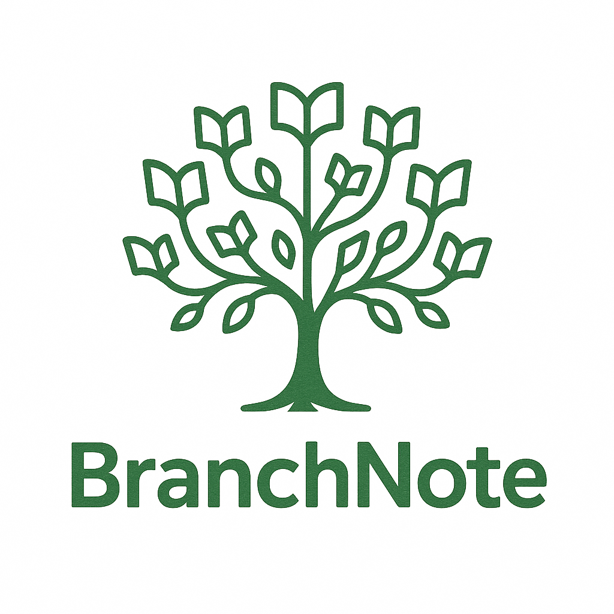

# BranchNodes !



==From text to visual==

Turning your words into ready , pretty and handy presentations !


This project took many turns from what i thought would be a sharing documents and asignments plateform to a way of presenting and reviewing notes in a visual and comprehensive manner that as far as i know isn't yet availible with such ease as just writting text normally !
---
# How to use !
==Plug and play==

## Demo [here](https://hechmiko.github.io/BranchNote/)

You just need to download this repository and then click on the 'run.bat' file
Or move the =='BranchNodes.bat'== which is a shortcut for the former file to your desktop for convenience (do not move 'run.bat' as it only works in this folder)

The run.bat files contain the following
```
start http://127.0.0.1:5000 // this is the local web adress for the flask app
flask run --debug // this starts the application
```
A terminal windows will pop and **you must not close it** as long as you want the application to keep running. That is the local server and it is not connected to internet.

---
## How to create notes

Once launched you will will have the option to login but for now that doesn't do much except greet you.

Once loged in you will find '**Create**' option in the navigation bar that should be a thourough enough explanation for how notes are created.

**But basically it's common markdown with the only difference being that a triple dash '\.\.\.' must be added between each block of content**

(which is usually displayed as horizontal seperating lines in websites and apps and such like the lines you see on top each title in this document on github)

---

# Technical implementations
==Trees==

This project is heavily if not fully affected with the tree data structure and although the implementations are all surface levels in terms of what trees are capable off if feel like this was a good way to learn about them and the logic in which they operate the three main files responsible for this project are:
1. the app.py
2. tree.py
3. tree.js
And even though it's not a 'file' the jinja dynamic generation is just as crucial
---
## app.py
The app.py is main flask app and it's used to handle anything user<->webapp related from accessing files , to managing accounts and each users own files to displaying suggestions and more minor things

overall the app.py is simple and straight forwards but isn't crucial for using the 'tree' in other apps if wished

---
## tree.py
This is where all the backend that goes into creating the tree structure and the conversion of markdown files happens it has two main things happening

1. the tree class
This is where the tree data structure is managed and where i implemented various application it in ways that serve the app and add QoL to it
#### Tree class allows for:
1. creating trees each tree has
    1. a significative name
    2. a brief description (details)
    3. vebose description (verbose)
    4. a **list** of children that are ... trees !
2. adding one or multiple children using the addChild and addChildren function
3. adding descriptions to a child of any child of the tree
4. finding the direct depth or the maxdepth which refer to the children count
5. describe the tree's content in the terminal which is helpful for debugging
6. lookup a node's direct parent in the tree which is very useful in the recursion process of markdownTree !
#### MarkdownTree function :
The markdownTree function takes a markdown file as input and returns a tree class object and it does so in recursion by continuously adding direct children of an parent until we hit an edge case which a title level higher than that of the parent's children when that happens we find the level of said parent in the hierarchy of the tree and pass the rest of the note in the recursion call and we keep doing that until it sits in it's intended spot and then we remove those lines and start filling that nodes own children if any are availible
##### Design choices :
The app uses dashes as delimiters for blocks and while this isn't necessary and as a matter of fact i did at first do the implemention to only account for a blocks level but doing so doesn't allow for usage of # as titles and so i chose to give up the use of dashes to preserve that of titles even inside blocks
---
# Tree.js
While this has nothing to do directly with the tree.py it's 100% linked to the 'markdown.html' jinja template so any and everything in tree.js is related to the 'graph-display' and 'descriptionBox' items in the template

The implementation is much more boring yet much more time consuming i only used vanilla javascript to create the visual connections between the elements and the various QoL little things here and there such as:
1. Drawing svgs dynamically and setting their sizes accordingly on many user interactions
2. the ability to focus on the path of nodes that you click or to show all of them
3. displaying indicators of active nodes
4. displaying a node's details in the descriptionBox
5. choosing between two display options vertical/horizontal
6. try to position elements neatly and nicely (as well as i could)


---
# AI usage
==beep bop==

AI was somewhat exclusively and heavily used when it came to the **css design of pages** as i didn't want to bother with html much although *all of the jinja implementation and the tree structure inside html were my design* and not with AI.
but yeah having it access the bootstrap library and me just choosing how i envision a certain div to look made the project come to fruition faster.

AI even made the logo awsome!
---
